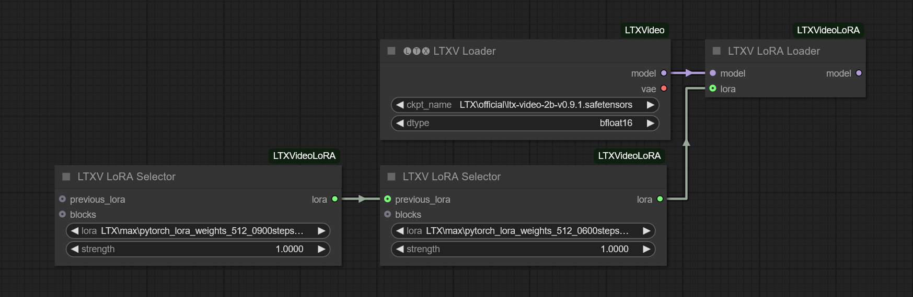
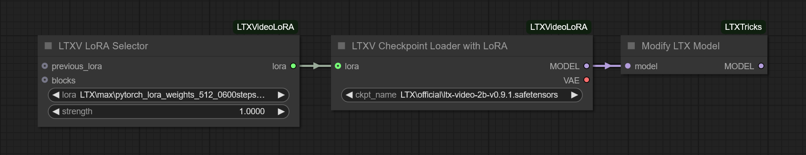
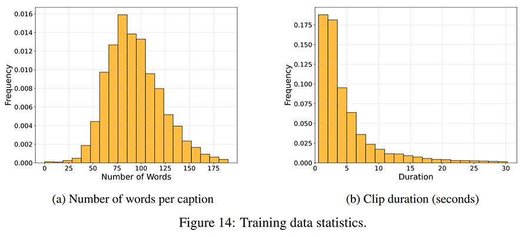

# ComfyUI-LTXVideoLoRA
A set of custom nodes enabling LoRA support for LTX Video in ComfyUI.

### 08.02.2025 ⭐ NEW ⭐

- Add LoRA support as a individual  **LTXV LoRA Loader** node > for Lightricks **ComfyUI-LTXVideo**
- Add LoRA support inside a **LTXV Checkpoint Loader with LoRA** node > for log(td) **ComfyUI-LTXTricks**
- Add LoRA selector node that can be chained using multiple **LTXV LoRA Selector**

The purpose of theses node are to enable using the **a-r-r-o-w's finetrainers** ([here](https://github.com/a-r-r-o-w/finetrainers)) LTXV LoRA directly inside ComfyUI.

The main code is inspired by:
- comfyanonymous **ComfyUI** ([here](https://github.com/comfyanonymous/ComfyUI))
- Lightricks **ComfyUI-LTXVideo** ([here](https://github.com/Lightricks/ComfyUI-LTXVideo)) 
- log(td) **ComfyUI-LTXTricks** ([here](https://github.com/logtd/ComfyUI-LTXTricks))
- kijai **ComfyUI-HunyuanVideoWrapper** ([here](https://github.com/kijai/ComfyUI-HunyuanVideoWrapper)) for the LoRA Selector / Block Edit nodes.

## Installation

#### Installation via ComfyUI-Manager

Installation via [ComfyUI-Manager](https://github.com/ltdrdata/ComfyUI-Manager) is preferred. Simply search for `ComfyUI-LTXVideoLoRA` in the list of nodes.

#### Manual installation

Simply clone this repository to `custom-nodes` folder in your ComfyUI installation directory.

## Example workflows

### Text-to-Video with LoRA support (ComfyUI-LTXVideo case)

https://github.com/user-attachments/assets/dac3287b-bd79-4e7e-8163-a27c40898be0

The Lightricks LTXV version is a special case. In order to use the official nodes without modification, you need to use the **LTXV LoRA Loader** right after the **LTXV Loader** as shown in this following screenshot:



LTXVideo-T2V-LoRA-Workflow : [Download](assets/LTXVideo-T2V-LoRA-Workflow.json)

### Text-to-Video with LoRA support (ComfyUI-LTXTricks case)

https://github.com/user-attachments/assets/dac3287b-bd79-4e7e-8163-a27c40898be0

The log(td) LTVX version is a more generic case. I've add a simplified **Checkpoint Loader** version that as no CLIP as output (LTXV safetensors contains only the UNET and the VAE) and a input node to chain your LoRAs. Here the loader is followed by the LTXTricks modified model, but you can use this checkpoint loader as a generic one for other LTX Video workflows.



LTXTricks-T2V-LoRA-Workflow : [Download](assets/LTXTricks-T2V-LoRA-Workflow.json)

### About the LoRA used in the previous examples

The LoRA used for the video samples. I've used the a-r-r-o-w's finetrainers to build a first basic training of 600 steps on 10 images (not video) in the resolution 512x512. The model used is 'Elizabeth Turner' a famous top-model in is early years of modeling. The result is not really convincing as you can see. For example here is few generation with FLUX using a LoRA trained with the same basic dataset.


### About the LTX-Video model

The original paper 'LTX-Video: Realtime Video Latent Diffusion' [here](https://arxiv.org/abs/2501.00103) do not describe the dataset source but we can see that the clip duration distribution is very limited to very shot length (less than 4 seconds).



After lot of generation, I can see that the dataset used for the preliminar model is very bad. I think a lot of video are recorded by a streaming Network-TV with a lot of logo and text overlays that appears sometimes with some bad prompts.

I'm sure that the LTXVideo model deserve a good finetuning. A good dataset of 10 seconds of high quality clip footage (no watermark, no text or logo overlay) would allow to obtain a commendable model for the generation of videos of about ten seconds in average users with poor quality GPUs. The use of a quality dataset with a better adherence to the prompts would be beneficial for the generation of LoRA on top.

Full fine training is perfectly possible using a-r-r-o-w's finetrainers. Training a LoRA is amazingly fast even on a computer like mine, I'll try to train a model soon to check if my instinct was right.

## Developers informations

The purpose of this set of ComfyUI nodes is to resolve the famous `lora key not loaded` warning in ComfyUI while loading LTXV LoRA with the common ComfyUI nodes.

As **comfyanonymous (ComfyUI)** said [here](https://github.com/comfyanonymous/ComfyUI/issues/6531#issuecomment-2629385999)

> To try to impose a consistent lora standard and because it's a pain to deal with I have decided to stop implementing any new lora format that uses diffusers keys.

The deal is that the output of a-r-r-o-w's finetrainers safetensors keys are well formatted for the diffuser, not for the distilled model (the 2B version of the UNET with the VAE embedded).

The diffuser weight keys of the LoRA are formatted in this way:
```
transformer.transformer_blocks.0.attn1.to_k.lora_A.weight
...
transformer.transformer_blocks.9.attn2.to_v.lora_B.weight
```
While the generic checkpoint loader of ComfyUI needs this format:
```
diffusion_model.transformer_blocks.0.attn1.to_k.lora_A.weight
...
diffusion_model.transformer_blocks.9.attn2.to_v.lora_B.weight
```
This is not the only problem. The ComfyUI-LTXVideo nodes of Lightricks build is own model that integrates an additional layer (`Transformer3DModel` inside `LTXVTransformer3D` class) the format therefore becomes:
```
diffusion_model.transformer.transformer_blocks.0.attn1.to_k.lora_A.weight
...
diffusion_model.transformer.transformer_blocks.9.attn2.to_v.lora_B.weight
```
That's why I've build a specific node for the Lightricks version, the **`LTXV LoRA Loader`** node. While all other common use needs only the **`LTXV Checkpoint Loader with LoRA`**.