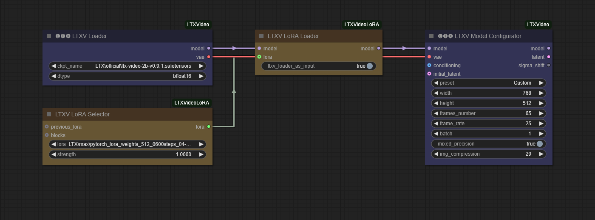
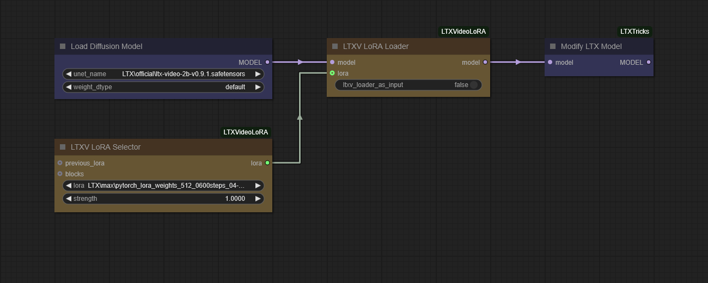
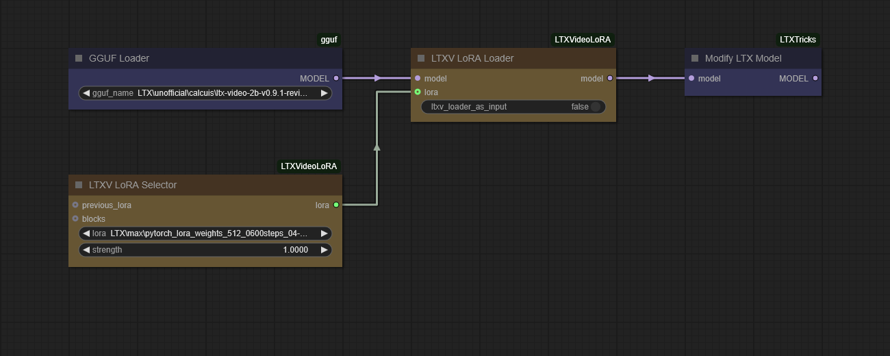

# ComfyUI-LTXVideoLoRA
A set of custom nodes enabling LoRA support for LTX Video in ComfyUI.

### 27.05.2025 ⭐ NEW ⭐

- Added **LTXV Wan2.1 LoRA Adapter** and **LTXV Wan2.1 LoRA Loader** nodes for compatibility with Wan2.1 series LoRAs (e.g., Fun-Reward-LoRAs)
- Enhanced mapping logic with partial matching capabilities
- Added debugging tools for model parameters and LoRA structure analysis

### 25.02.2025

- Update the **LTXV LoRA Loader** node for the **GGUF** support as a generic way
- Remove useless **LTXV Checkpoint Loader with LoRA** node

Please refer to the quantized versions of :
- **calcuis** - GGUF quantized and fp8 scaled versions of LTX-Video ([here](https://huggingface.co/calcuis/ltxv-gguf))
- **city96** - direct GGUF conversion of Lightricks/LTX-Video ([here](https://huggingface.co/city96/LTX-Video-gguf))

### 08.02.2025 - First release

- ~~Add LoRA support as a individual  **LTXV LoRA Loader** node > for Lightricks **ComfyUI-LTXVideo**~~
- ~~Add LoRA support inside a **LTXV Checkpoint Loader with LoRA** node > for log(td) **ComfyUI-LTXTricks**~~
- Add LoRA selector node that can be chained using multiple **LTXV LoRA Selector**

## Installation

#### Installation via ComfyUI-Manager

Installation via [ComfyUI-Manager](https://github.com/ltdrdata/ComfyUI-Manager) is preferred. Simply search for `ComfyUI-LTXVideoLoRA` in the list of nodes.

#### Manual installation

Simply clone this repository to `custom-nodes` folder in your ComfyUI installation directory.

## Usage

### LTXV LoRA with the ComfyUI-LTXVideo nodes

> [!CAUTION]
> Because the **LTXV Loader** official node use a specific model structure, you need to put the *ltxv_loader_as_input* option as **true**.

### LTXV LoRA with the ComfyUI-LTXTricks nodes

> [!NOTE]
> Here the input node can be  the **'Load Diffusion Model'** node or the **'Load Checkpoint'** node  as well.

### LTXV LoRA with the GGUF Loader nodes

> [!TIP]
> As you can see, you can use the GGUF with the LoRA loader followed by the modified LTX model by log(td)'s LTXTricks nodes.

### LTXV with Wan2.1 LoRA Adapter

> [!NOTE]
> This allows you to use Wan2.1 series LoRAs (including Fun-Reward-LoRAs) with LTXV model.

#### LTXV Wan2.1 LoRA Adapter Node Parameters

| Parameter | Description | Recommended Setting |
|-----------|-------------|--------------------|
| **lora** | Select the Wan2.1 LoRA file to load | Any Wan2.1 series LoRA |
| **strength** | Control the intensity of the LoRA effect | 0.5-0.7 for best results |
| **force_wan21_mode** | Force using Wan2.1 mapping rules | `true` for Fun-Reward-LoRAs |
| **show_mapping_details** | Show detailed mapping information in logs | `true` for debugging, `false` for normal use |
| **custom_mapping_rules** | Add custom key mapping rules in JSON format | Optional, for advanced users |

#### LTXV Wan2.1 LoRA Loader Node Parameters

| Parameter | Description | Recommended Setting |
|-----------|-------------|--------------------|
| **ltxv_loader_as_input** | Specify if input model comes from LTXV Loader | `true` when using official LTXV Loader |
| **dump_lora_structure** | Output LoRA structure details to logs | `true` for first use with new LoRAs |
| **dump_model_params** | Show model parameter names in logs | `true` for first use, then `false` |
| **only_keys_with_matches** | Only apply perfectly matched keys | `false` to allow partial matching |
| **partial_match** | Enable partial key matching for better compatibility | `true` for higher adaptation rate |

## LoRA Training

For a **blazing fast training** of your LTXV LoRA you can use:
- **a-r-r-o-w's finetrainers** ([here](https://github.com/a-r-r-o-w/finetrainers))

## Credit and greetings

The main code is inspired by:
- comfyanonymous **ComfyUI** ([here](https://github.com/comfyanonymous/ComfyUI))
- Lightricks **ComfyUI-LTXVideo** ([here](https://github.com/Lightricks/ComfyUI-LTXVideo)) 
- log(td) **ComfyUI-LTXTricks** ([here](https://github.com/logtd/ComfyUI-LTXTricks))
- kijai **ComfyUI-HunyuanVideoWrapper** ([here](https://github.com/kijai/ComfyUI-HunyuanVideoWrapper)) for the LoRA Selector / Block Edit nodes.
